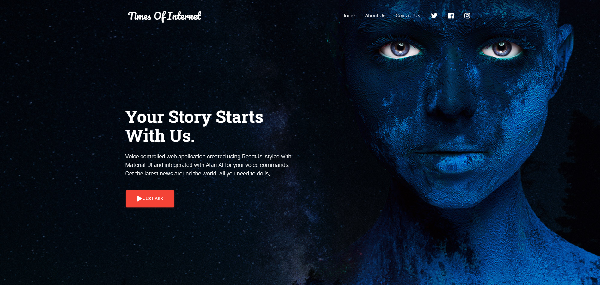

# Times Of Internet

Click here for Live version : [timesofinternet.netlify.app](timesofinternet.netlify.app/)



Its a voice controlled web application created using ReactJS, styled with Material-UI and integrated with Alan-AI for voice commands. It will give you the news from all over the world. All you need to do is, JUST ASK!

### To run

Requirements

- Node / yarn
- ReactJS

#### Steps

```
npm install
```

```
npm start
```

#### Or

```
yarn install
```

```
yarn start
```
