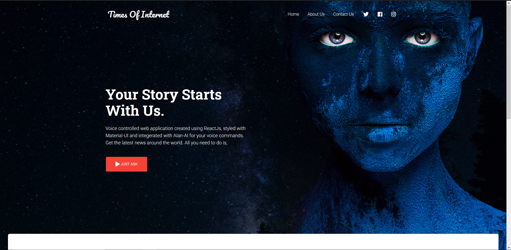

# Times Of Internet

Its a voice controlled web application created using ReactJS, styled with Material-UI and integrated with Alan-AI for voice commands. It will give you the news from all over the world. All you need to do is, JUST ASK!

**This is the home page that will greet you when you open the app**

**Scroll down to find exmaples of what you can ask the TimesOfInternet app.**

**Click on the just ask button on the home page to begin asking the AI for news and you will be prompted as follows.**

**Allow the web app to use your mic and notice the blue mic floating icon on your bottom right it can be dragged around as preferred.**

Have fun using this web app for your news !
